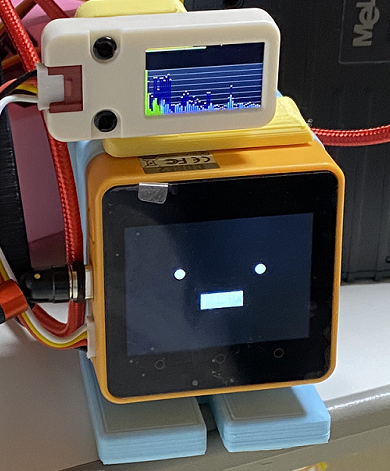

# M5Stack_avatar_Unified_BTSPK_MultiDisp
M5Stack_avatar_Unified_BTSPK_MultiDisp

OLED/LCD表示付きBluetooth Speaker版M5Stack-Avatarです。 

  

---
### このプログラムを動かすのに必要な物 ###
* [M5Stack](http://www.m5stack.com/ "Title") (M5Stack Gray、Core2で動作確認をしました。) 
* [OLEDディスプレイユニット](https://www.switch-science.com/catalog/7233/ "Title") または [ LCDディスプレイユニット](https://www.switch-science.com/catalog/7358/ "Title")
* Arduino IDE (バージョン 1.8.15で動作確認をしました。) 
* [M5Unified](https://github.com/m5stack/M5Unified/tree/develop/ "Title")ライブラリ((バージョン 0.0.5で動作確認をしました。)) 
* [M5GFX](https://github.com/m5stack/M5GFX/tree/develop/ "Title")ライブラリ(バージョン 0.0.18で動作確認をしました。) 
* [ESP32-A2DP](https://github.com/pschatzmann/ESP32-A2DP/ "Title")ライブラリ 
  
